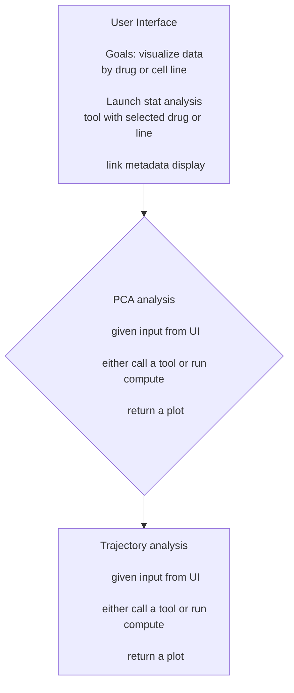

<h1>Tahoe 100M Data	Group 6</h1>

```mermaid
graph TD;
    A[User Interface

	Goals: visualize data by drug or cell line

	Launch stat analysis tool with selected drug or line

	link metadata display] --> B{PCA analysis

	given input from UI

	either call a tool or run compute

	return a plot} --> C[Trajectory analysis

	given input from UI

	either call a tool or run compute

	return a plot];
```