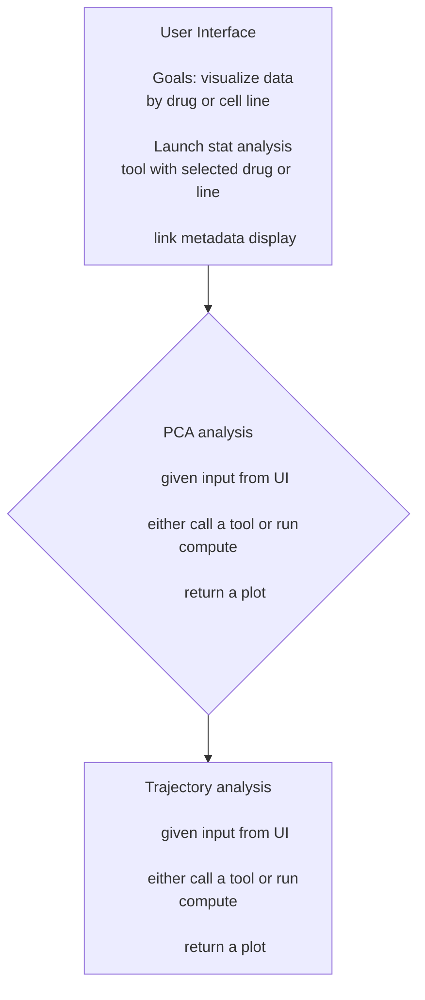

  

**Group 6 — BCM Hackathon 2026** (Tue 2026-08-25 – Thu 2026-08-27)

> 🚧 Hackathon scope and workflow reflect Day 1 planning and are still in flux — see [`PROJECT_SUMMARY.md`](./PROJECT_SUMMARY.md) for the day-by-day project log.

## Background: the Tahoe-100M dataset

[Tahoe-100M](https://doi.org/10.1101/2025.02.20.639398) (Zhang, Ubas, de Borja, Svensson, Thomas et al., 2025; Tahoe Therapeutics + Parse Biosciences) is a giga-scale single-cell perturbation atlas:

- **100.6M single-cell transcriptomes** (95.6M passing full QC filters) across **50 cancer cell lines** and **>1,100 small-molecule perturbations**.
- Generated on the **Mosaic platform**: cell-line "villages" co-cultured as spheroids, drug-treated for 24h, dissociated, and profiled via the Parse GigaLab combinatorial-barcoding scRNA-seq assay (sequenced by Ultima Genomics), with SNP-based deconvolution to assign cells back to their cell line of origin.
- 14 total 96-well plates of spheroids. **Plate 14 is the designated biological replicate of Plate 6** — the paper reports pseudobulk Pearson correlation of 0.97–0.98 for matched treatment/cell-line pairs vs. 0.89–0.93 for unmatched pairs across the two plates, which is what makes a plate 6 → plate 14 train/validate split meaningful.
- The **analysis-ready subset** this project uses: **47 cell lines** (13 organs; TP53/KRAS/CDKN2A altered in ~half of lines), **379 drugs** (180 mapped to 25 mechanisms of action), **1,135 drug-dose combinations**, **52,886 unique cell line-drug-dose conditions**, median ~1,287 cells/condition, plus DMSO vehicle controls on every plate.
- **Data format:** expression matrices + metadata as AnnData/H5AD, hosted on **HuggingFace**. Raw sequencing reads (FASTQ/BAM) are *not* part of the public release — needed for any splicing/allele-specific-expression/variant-calling work, which is why that's out of scope unless we obtain separate access.

## What we're building

Tahoe-100M reports, for each drug/dose/cell-line condition, how far the *average* cell moved relative to DMSO controls. But population averages hide heterogeneity: a "weak" mean response can conceal a strong response in most cells plus a residual, control-like subpopulation that didn't respond at all.

We're building a **replicate-tested response-completeness screen**: for each drug × dose × cell line, we measure not just *how strongly* the treated population moved away from plate-matched DMSO, but *how completely* it moved — i.e., what fraction of cells remain control-like. The scoring rule is calibrated on one plate and frozen before being tested, unchanged, on an independent biological replicate plate.

> *"Tahoe tells us how far the average cell moved. We measure how completely the population moved, show that the pattern repeats, and flag what the average left behind."*

This is **not** pitched as the first analysis to look beyond pseudobulk — other work (including the Tahoe-100M paper itself) already discusses responder/non-responder mixtures qualitatively. The gap we're targeting is a **quantitative, uncertainty-aware, replicate-validated** completeness metric, evaluated systematically across conditions.

## Method: what "response completeness" means

For each **drug × dose × cell line** condition, relative to its plate-matched DMSO control, we aim to measure:

1. **Response magnitude** — how far the treated population moved.
2. **Response coverage / completeness** — what fraction of the population still looks control-like (a residual, unmoved subpopulation), reported as a **condition-level fraction with uncertainty**, not a per-cell hard label.
3. **Distribution shape change** — whether treatment shifts, widens, compresses, or *splits* the population into a bimodal/multimodal state.

### Validation

1. Develop and calibrate the scoring rule on **Plate 6** only.
2. **Freeze the rule** before looking at Plate 14.
3. Apply the frozen rule unchanged to **Plate 14** as the validation set.
4. Report at least one clear example where the plate-14 result reproduces a case where the single-cell distribution reveals something the mean hides.

### Calibration and confounders

- Don't rely on a fixed threshold (e.g., "2 standard deviations from the median") as the final method — treatment and DMSO distributions can be asymmetric and naturally overlapping, so a fixed cutoff is, at best, a quick baseline.
- Calibrate the "control-like" cutoff using **DMSO-vs-DMSO comparisons within a plate**, so we know the baseline rate of apparent non-response/separation even between two control wells.
- Before calling a residual subpopulation biologically interesting, check whether it's explained by a technical/quality confound: **RNA depth, mitochondrial fraction, or cell-cycle state**.

### Terminology guardrails

Tahoe-100M is a single 24-hour endpoint — not a time course or lineage-traced experiment — so:

- Prefer **"state-space branching," "multimodality,"** or **"response geometry"** over "trajectory" (which implies an observed path over time).
- Prefer **"control-like residual population"** or **"candidate incomplete-response state"** over "resistant" or "persister" cells, which imply a stronger biological claim than single-timepoint data supports.
- A compound whose Tahoe signature opposes a residual expression program is a **hypothesis for a future combination experiment**, not evidence of synergy.

## Architecture

The UI dispatches to two backend analysis modules — PCA analysis and trajectory/state-space branching analysis — each of which takes UI-selected input (drug, cell line, etc.), either calls an external tool or runs compute locally, and returns a plot to be rendered in the UI. The **response-completeness scoring module** (the scientific core described above) sits underneath/alongside these as the shared metric both visualizations should be able to surface — exact integration TBD as the workflow firms up.

## Deliverables (priority order)

1. **Core:** One ranked response-completeness table across conditions (drug × dose × cell line).
2. One **plate-14-replicated example** where the mean hides a residual or split response.
3. One **testable follow-up compound hypothesis**, nominated because its Tahoe signature opposes an observed residual expression program in the same cell line (explicitly a hypothesis, not evidence of synergy).
4. **Stretch:** Data browser/widget for non-bioinformaticians — most compelling once it can display a validated result (mean shift, response coverage, distribution shape, plate replication, relevant pathways) rather than being the whole project.
5. **Stretch:** External annotation tie-ins (e.g., [pandrugs.org](https://www.pandrugs.org), DepMap) for genotype interpretation or follow-up compound nomination.

**Explicitly out of scope for this hackathon:** variant calling, splicing, and allele-specific expression analysis — these require raw FASTQ/BAM reads, which are not in the public release and are only being pursued as a stretch/parallel track pending separate data access.

## Team

| Name | Background | Focus area |
|---|---|---|
| Don Baldwin | Biology; former lead, UPenn bioinformatics corps | Raw sequence data access, figures |
| Anna Sokolova | Computational biology, signal processing, EEG/BCI, ML pipelines | Response-completeness scoring: plate 6 prototype → DMSO calibration → plate 14 validation |
| Candice Wu | PhD candidate, sequencing & bioinformatics (Univ. of Iowa) | Data interface / browser widget |
| Tuneer | PhD candidate, genomics (oral cancer), single-cell + WGS + transcriptomics | Trajectory / state-space branching analysis |
| Abdul Shiwoku | Math/stats, systems analyst, transitioning into bioinformatics | Repo infrastructure; statistical methods for subpopulation detection |
| Cecilia Mathó | Assistant professor of genetics (Universidad de la República) | PCA visualization; pandrugs.org / annotation feasibility |
| Gerald McCollam | MS in Bioinformatics, Johns Hopkins University | Writer
 
## Data access

- Expression matrices + metadata (H5AD): **HuggingFace** (per the Tahoe-100M paper's Data Availability statement).
- DNA Nexus: separate track for raw sequencing data (FASTQ/BAM) access, pursued by Don — not the expression-matrix source.
- Recommended starting point: **Plate 6** and **Plate 14** only (the full ~100M-cell atlas is too large to load into tools like Seurat directly — batch/streaming processing needed for anything broader).

## Repo status

This repo is being scaffolded during the hackathon; code, environment setup, and exact tooling choices are not finalized. Check [`PROJECT_SUMMARY.md`](./PROJECT_SUMMARY.md) for the current day-by-day status, open questions, and action items before starting new work, to avoid duplicating an in-flight assignment.

## Acknowledgments

Built on the [Tahoe-100M](https://doi.org/10.1101/2025.02.20.639398) atlas from Tahoe Therapeutics and Parse Biosciences (sequencing by Ultima Genomics). This is an independent hackathon analysis project and is not affiliated with Tahoe Therapeutics.
